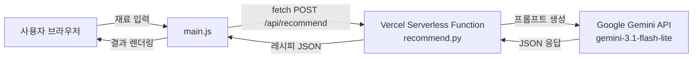

# 집밥요정 🧚

> 냉장고에 있는 재료만 알려주면, AI가 오늘 저녁 메뉴를 추천해주는 웹 서비스

**배포 URL**: https://codyssey-a3-topaz.vercel.app
**GitHub**: https://github.com/040611bluesky-creator/codyssey-A3

| 항목 | 내용 |
|---|---|
| 프론트엔드 | HTML / CSS / JavaScript (Vanilla) |
| 백엔드 | Python (Vercel Serverless Functions) |
| AI | Google Gemini API (`gemini-3.1-flash-lite`) |
| 배포 | Vercel |

---

## 목차
1. [프로젝트 소개](#프로젝트-소개)
2. [핵심 기능](#핵심-기능)
3. [페이지 구성](#페이지-구성)
4. [아키텍처](#아키텍처)
5. [API 명세](#api-명세)
6. [기술 스택](#기술-스택)
7. [프로젝트 구조](#프로젝트-구조)
8. [로컬 실행 방법](#로컬-실행-방법)
9. [배포 방법](#배포-방법)
10. [환경 변수](#환경-변수)
11. [트러블슈팅 기록](#트러블슈팅-기록)

---

## 프로젝트 소개

집밥요정은 냉장고 속 재료를 입력하면 AI(Google Gemini)가 인원, 조리 시간,
입맛 취향에 맞는 집밥 레시피를 추천해주는 서비스입니다.

- **타겟 사용자**: 자취생, 요리 초보, "오늘 뭐 먹지" 고민하는 직장인
- **핵심 가치**: 냉장고 재료를 활용해 장을 보러 나가지 않고도, 지금 바로 만들 수 있는
  메뉴를 빠르게 결정할 수 있도록 도와줌

## 핵심 기능

- 🥕 **재료 태그 입력**: 엔터로 추가/삭제, 자주 쓰는 재료 원클릭 추가
- ⚙️ **맞춤 옵션**: 인분(1~4인분) / 조리 시간(15·30·60분) / 입맛(담백·매콤·구수·든든)
- 🤖 **AI 레시피 추천**: 입력 조건에 맞는 레시피 최대 3개, 재료·조리법 포함
- 🚫 **비정상 입력 필터링**: 식재료가 아닌 단어만 입력되면 억지로 답을 만들지 않고 안내
- 📱 **반응형 디자인**: 모바일/태블릿/데스크톱 대응
- 🌙 **다크 모드**: 우측 상단 토글, `localStorage`로 설정 유지
- ⚠️ **실패 처리**: 빈 입력 / API 오류 / 응답 지연 / 비정상 입력 각각 전용 안내 메시지

## 페이지 구성

| 섹션 | 경로 | 설명 |
|---|---|---|
| 메인 (Hero) | `#main` | 서비스 소개, 핵심 가치 안내 |
| AI 추천 | `#recommend` | 재료 입력 폼, 옵션 선택, 레시피 결과 |
| 소개 | `#about` | 서비스 설명, 이용 방법 |

한 페이지(`index.html`) 안에서 상단 고정 네비게이션으로 각 섹션을 부드럽게 스크롤 이동합니다.

## 아키텍처



## API 명세

### `POST /api/recommend`

**요청 (Request Body)**
```json
{
  "ingredients": ["계란", "대파", "김치"],
  "servings": "2",
  "time": "30",
  "taste": "매콤"
}
```

**성공 응답 (200)**
```json
{
  "recipes": [
    {
      "name": "김치계란볶음밥",
      "ingredients": ["김치", "계란", "밥", "대파"],
      "method": "대파를 볶다가 김치를 넣고..."
    }
  ]
}
```

**실패 응답**

| 상태 코드 | 상황 | 메시지 예시 |
|---|---|---|
| 400 | 재료 미입력 | "재료를 1개 이상 입력해주세요" |
| 400 | 식재료가 아닌 입력만 존재 | "입력하신 내용에서 사용할 수 있는 식재료를 찾지 못했어요. 재료를 다시 확인해 주세요" |
| 500 | Gemini 쿼터 초과 (429) | "지금 요청이 많아 AI가 바빠요. 잠시 후 다시 시도해주세요" |
| 500 | 기타 API 오류 / 타임아웃 | "잠시 후 다시 시도해주세요" |

## 기술 스택

- **프론트엔드**: HTML, CSS, JavaScript (바닐라, 프레임워크 미사용)
- **백엔드**: Python (Vercel Serverless Functions)
- **AI SDK**: `google-genai` (공식 최신 SDK)
- **AI 모델**: `gemini-3.1-flash-lite`
- **배포**: Vercel

## 프로젝트 구조

```
codyssey-A3/
├── index.html
├── css/
│   └── style.css
├── js/
│   └── main.js
├── api/
│   └── recommend.py
├── requirements.txt
└── vercel.json
```

## 로컬 실행 방법

1. 저장소를 클론합니다.
```bash
   git clone https://github.com/040611bluesky-creator/codyssey-A3.git
   cd codyssey-A3
```
2. Vercel CLI를 설치합니다.
```bash
   npm install -g vercel
```
3. 프로젝트 루트에 `.env` 파일을 만들고 아래 내용을 입력합니다.
```
   GEMINI_API_KEY=발급받은_API_키
```
4. 로컬 서버를 실행합니다.
```bash
   vercel dev
```
5. 터미널에 출력되는 주소(예: `http://localhost:3000`)로 접속합니다.

## 배포 방법

1. GitHub 저장소를 Vercel과 연동합니다.
2. Vercel 프로젝트의 **Settings → Environment Variables**에 `GEMINI_API_KEY`를 등록합니다.
   (Production, Preview, Development 환경 모두 체크 권장)
3. `main` 브랜치에 push하면 자동으로 재배포됩니다.

## 환경 변수

| 이름 | 설명 |
|---|---|
| `GEMINI_API_KEY` | Google AI Studio(aistudio.google.com)에서 발급받은 Gemini API 키 |

⚠️ API 키는 `.env` 파일과 Vercel 환경 변수에만 저장하며, 코드나 커밋 이력에 노출하지 않습니다.
`.env`는 `.gitignore`에 포함되어 GitHub에 업로드되지 않습니다.

## 트러블슈팅 기록

개발 과정에서 겪은 주요 이슈와 해결 방법입니다.

| 이슈 | 원인 | 해결 |
|---|---|---|
| Vercel 배포 시 `No python entrypoint found` | Python 함수 진입점 설정 방식 혼동 | `api/*.py`의 `handler` 클래스를 자동 인식하도록 설정 단순화 |
| 배포 후 모든 요청이 API 함수로만 라우팅됨 | `pyproject.toml` 존재 시 Vercel이 프레임워크 모드로 오인식 | `vercel.json`에 정적 파일과 API 함수 라우팅을 명시적으로 분리 |
| Gemini 호출 시 간헐적 실패 | 지원 종료(EOL)된 `google-generativeai` 패키지 사용 | 공식 최신 SDK `google-genai`로 마이그레이션 |
| 429 Too Many Requests | Gemini 무료 티어 분당 요청 한도 초과 | 지수 백오프 재시도 로직 추가, 무료 한도가 더 넉넉한 `gemini-3.1-flash-lite`로 모델 교체 |
| 다크 모드에서 일부 요소 안 보임 | CSS에 다크모드 대응 색상 변수 미적용 | `color-scheme` 및 CSS 변수 기반 색상 체계로 전환 |